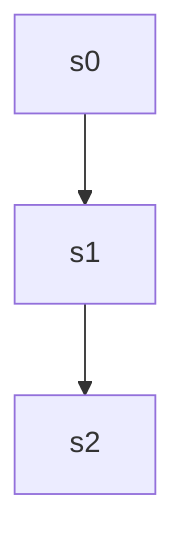

# gsm8k — `gsm8k-2` reasoning DAG

| model | steps | continue | backtrack | merge | depth | leaves | super-nodes |
|---|---|---|---|---|---|---|---|
| 32B | 3 | 2 | 0 | 0 | 2 | 1 | 1 |
| 1.5B | 3 | 2 | 0 | 0 | 2 | 1 | 1 |

## 32B — seed 1000, correct=True

`-->` continue &nbsp;&nbsp; `-.->` backtrack &nbsp;&nbsp; `==>` merge

### Steps and attachments

| step | action | parents | judge rationale | text |
|---|---|---|---|---|
| s0 | root | [] | root | First, I need to determine the total cost Josh incurred. He bought the house for $80,000 and spent an addition |
| s1 | continue | [0] | s1 continues the analysis by calculating the increased value after the repairs, building on the total cost est | Next, I'll calculate the increased value of the house after the repairs. The repairs increased the house's val |
| s2 | continue | [1] | s2 logically follows s1 by using the increased value calculated there to determine the selling price and profi | Finally, I'll find the selling price by adding the increased value to the original price. This results in a se |

## 1.5B — seed 1001, correct=True

`-->` continue &nbsp;&nbsp; `-.->` backtrack &nbsp;&nbsp; `==>` merge

### Steps and attachments

| step | action | parents | judge rationale | text |
|---|---|---|---|---|
| s0 | root | [] | root | First, Josh buys the house for $80,000 and then spends an additional $50,000 on repairs. This increases the va |
| s1 | continue | [0] | s1 logically follows s0 by calculating the new house value based on the information provided. It is a straight | To calculate the new value of the house after the increase, I'll first determine the total amount spent on rep |
| s2 | continue | [1] | s2 logically follows s1 by using the calculated new value to determine profit, continuing the sequential analy | Next, I'll calculate the profit by subtracting the total investment from the new value of the house. Subtracti |
