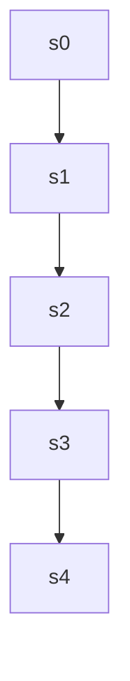

# gsm8k — `gsm8k-54` reasoning DAG

| model | steps | continue | backtrack | merge | depth | leaves | super-nodes |
|---|---|---|---|---|---|---|---|
| 32B | 5 | 4 | 0 | 0 | 4 | 1 | 1 |
| 1.5B | 126 | 65 | 45 | 15 | 13 | 28 | 80 |

## 32B — seed 1000, correct=True

`-->` continue &nbsp;&nbsp; `-.->` backtrack &nbsp;&nbsp; `==>` merge

### Steps and attachments

| step | action | parents | judge rationale | text |
|---|---|---|---|---|
| s0 | root | [] | root | The Doubtfire sisters have 7 adopted kittens. |
| s1 | continue | [0] | s1 directly continues from s0 by calculating Patchy's kittens based on the number given in s0. | Patchy, the first cat, has had thrice the number of adopted kittens. So, 3 times 7 is 21. |
| s2 | continue | [1] | s2 introduces another cat, Trixie, and her kittens, continuing the flow from s1 which discussed Patchy. It doe | Trixie, the other cat, has had 12 kittens. |
| s3 | continue | [2] | s3 logically follows s2 by summing all the kittens mentioned, continuing the sequence without backtracking or  | To find the total number of kittens, add the adopted kittens, Patchy's kittens, and Trixie's kittens together: |
| s4 | continue | [3] | s4 is performing the arithmetic calculation that was set up in s3, continuing the logical flow without introdu | Calculating that gives 7 + 21 = 28, and 28 + 12 = 40. |

## 1.5B — seed 1003, correct=True

*(126 steps — too large to draw; see `dags.jsonl` for the full graph.)*

### Steps and attachments

| step | action | parents | judge rationale | text |
|---|---|---|---|---|
| s0 | root | [] | root | Okay, so I have this problem here about the Doubtfire family and their kittens. Let me read it again carefully |
| s1 | continue | [0] | The current step s1 is a continuation of the problem introduced in s0, asking how many kittens the family has  | "The Doubtfire sisters are driving home with 7 kittens adopted from the local animal shelter when their mother |
| s2 | continue | [1] | s2 is continuing the problem-solving process by acknowledging the initial information and identifying the need | Alright, so the family has 7 kittens that were already adopted. Then, two house cats adopted kittens, but the  |
| s3 | continue | [2] | s3 is clarifying the problem statement by breaking down the information about the number of kittens each cat h | Wait, let me check: "the first cat, Patchy, has had thrice the number of adopted kittens, while Trixie, the ot |
| s4 | backtrack | [1] | s4 is questioning the initial understanding of the problem, indicating a need to revisit earlier assumptions.  | But wait, are the 7 kittens adopted from the shelter, and then the house cats adopted them? Or are they just a |
| s5 | continue | [4] | s5 is clarifying the problem setup, continuing the main path's reasoning without backtracking or merging. | Wait, maybe I need to clarify the problem. So, the family has 7 kittens adopted from the shelter. Then, their  |
| s6 | continue | [5] | s6 is clarifying the timeline of the kittens' adoption, continuing the reasoning from s5 without backtracking  | But the problem is a bit unclear on whether the 7 kittens are still in the shelter or not. Wait, the sentence  |
| s7 | continue | [6] | s7 continues the reasoning from s6 by adding the house cats' kittens to the adopted ones, without referring to | So, if the 7 were adopted, then the family's total would be 7, but then the house cats adopted more. So, we ne |
| s8 | merge | [3, 7] | s8 is merging the information from the main path (s7) and the other branch (s3) to address the ambiguity in th | But the problem is, we don't know how many each house cat adopted. It says "thrice the number of adopted kitte |
| s9 | backtrack | [1] | s9 is re-examining the problem statement to clarify confusion, indicating a backtrack to s1. | Wait, maybe I need to parse it again. |
| s10 | backtrack | [1] | s10 is restating the problem, which suggests it's backtracking to an earlier step to re-examine the problem st | "The Doubtfire sisters are driving home with 7 kittens adopted from the local animal shelter when their mother |
| s11 | continue | [10] | s11 is continuing the reasoning from s10 by adding the number of adopted kittens to the new kittens from the h | So, the 7 kittens were adopted, and then the house cats adopted kittens. The mother tells them that the two ho |
| s12 | continue | [11] | s12 continues the reasoning from s11 by providing specific details about the number of kittens each house cat  | But the problem is, how many kittens did each house cat have? It says Patchy has had thrice the number of adop |
| s13 | merge | [8, 9, 12] | s13 is re-examining the problem's wording and combining insights from both the main path and other branches, i | Wait, hold on. So, perhaps the 7 were adopted, and then the house cats each adopted some number of kittens. Bu |
| s14 | continue | [13] | s14 continues the analysis by reinterpreting the meaning of "thrice the number of adopted kittens" as referrin | Wait, maybe "thrice the number of adopted kittens" refers to the 7 that were already adopted. So, if the 7 wer |
| s15 | continue | [14] | s15 is reflecting on the previous calculation and questioning the assumption about the 7 kittens, suggesting a | Wait, but that would be 7 + 21 + 12 = 40. But that seems a lot, and the problem doesn't specify whether the 7  |
| s16 | backtrack | [14] | s16 is reconsidering the initial assumption about the 7 adopted kittens, questioning whether they should be in | Wait, perhaps the 7 were already adopted, so they were gone. Then, the house cats adopted some number of kitte |
| s17 | continue | [16] | s17 continues the reasoning from s16 by clarifying the status of the 7 kittens, building on the previous thoug | But the problem is, it's not clear whether the 7 are still in the shelter or not. It says, "when their mother  |
| s18 | continue | [17] | s18 continues the reasoning from s17 by elaborating on the number of kittens each house cat adopted, without i | So, the family has the 7 kittens that were adopted, and then the house cats adopted some number. But the probl |
| s19 | continue | [18] | s19 continues the reasoning from s18 by calculating the total number of kittens based on the previous discussi | Wait, maybe the 7 were already adopted, so the total number is 7, and the house cats adopted 3*7=21 and 12. So |
| s20 | merge | [15, 19] | s20 is combining the reasoning from the main path (s19) and another branch (s15) to explore an alternative app | Alternatively, maybe the 7 were adopted, and the house cats adopted some number, but the problem is not giving |
| s21 | continue | [20] | s21 continues the reasoning from s20 by confirming the total number of kittens by adding the numbers together. | Wait, but 21 and 12 are not the number of adopted, but the number of kittens each house cat has had. So, the 7 |
| s22 | continue | [21] | s22 is a continuation of the reasoning from s21, questioning the high number of kittens calculated in s21. | But that seems like a lot, and the problem is presented in a way that might not require such a high number. |
| s23 | backtrack | [16] | s23 is re-examining the initial assumption about the 7 adopted kittens, suggesting they are the only ones coun | Wait, maybe the 7 were adopted, and then each house cat adopted some number, but the problem is not giving the |
| s24 | backtrack | [16] | s24 revisits the earlier reasoning that the 7 kittens were adopted and the house cats adopted more, backtracki | Wait, but the mother is informing them that the house cats have just had kittens. So, that would mean that the |
| s25 | backtrack | [16] | s25 is reconsidering the assumption that the 7 kittens were adopted, which was made in s16 and s24. It suggest | Wait, maybe the 7 are still in the shelter, and the house cats adopted more. So, the total number of kittens i |
| s26 | continue | [25] | s26 continues the main path by reiterating the ambiguity in the problem's phrasing, building on s25's consider | But the problem is, we don't know how many each house cat adopted. It only says that Patchy had thrice the num |
| s27 | backtrack | [16] | s27 is presenting an alternative interpretation, suggesting a backtrack to re-examine the assumption about the | Alternatively, maybe the 7 were adopted, and the house cats adopted some number, but the problem is only givin |
| s28 | continue | [27] | s28 continues the reasoning from s27 by calculating the total number of kittens based on the information provi | Wait, maybe I need to think of it as the 7 were already adopted, and then the house cats adopted 3*7=21 and 12 |
| s29 | continue | [28] | s29 is evaluating the previous conclusion in s28, questioning the high number and considering alternative inte | But that seems too high, and the problem might be expecting just the 7, but that doesn't make sense because th |
| s30 | backtrack | [28] | s30 revisits the calculation from s28, reiterating the same reasoning about Patchy and Trixie's kittens. This  | Wait, maybe the 7 were adopted, and then the house cats adopted 3 times the number of the shelter had, which w |
| s31 | continue | [30] | s31 is a straightforward continuation of s30, where the numbers mentioned in s30 are summed up to reach the to | So, total is 7 + 21 + 12 = 40. |
| s32 | backtrack | [30] | s32 repeats the same calculation as s31, indicating a backtrack to an earlier step where this reasoning was al | Alternatively, perhaps the 7 were adopted, and the house cats adopted 3 times as much as the number of the she |
| s33 | backtrack | [30] | s33 is re-examining the components of the problem without the total, suggesting a backtrack to a previous step | Alternatively, maybe it's just the 7 kittens, and the house cats adopted 3*7=21, but the problem says Trixie h |
| s34 | continue | [33] | s34 continues the reasoning from s33 by adding the 7 adopted kittens to the total, building on the previous ca | Wait, perhaps the 7 were already adopted, and the house cats adopted 3 times the number of the shelter had, wh |
| s35 | continue | [34] | s35 repeats the same reasoning as s34, indicating a continuation of the thought process. | Alternatively, perhaps the 7 were adopted, and the house cats adopted 3 times as many as the number of the she |
| s36 | continue | [35] | s36 introduces a new alternative scenario, continuing the exploration of possible interpretations without merg | Alternatively, maybe the 7 are still in the shelter, and the house cats adopted 21 and 12, so total is 7 +21 + |
| s37 | backtrack | [30] | s37 expresses uncertainty about the previous conclusion, suggesting a need to revisit earlier reasoning. This  | But I'm not sure if that's the case. |
| s38 | backtrack | [16] | s38 is re-examining the initial assumption about the 7 adopted kittens, suggesting a backtrack to an earlier s | Wait, maybe I should think of it differently. The 7 were already adopted, so they are gone. Then, the house ca |
| s39 | continue | [38] | s39 is pointing out a problem with the current approach, suggesting a need to revisit earlier reasoning. It is | But the problem is, we don't know how many each house cat adopted. It only says that Patchy has had thrice the |
| s40 | continue | [39] | s40 logically follows s39 by calculating the total number of kittens based on the information provided in s39. | Wait, so if the 7 were adopted, then Patchy has had 3*7=21, and Trixie has had 12. So, total is 7 +21 +12=40. |
| s41 | backtrack | [38] | s41 is introducing an alternative interpretation of the problem, suggesting a different approach to calculatin | Alternatively, if the 7 were adopted, and the house cats adopted some number, but the problem is only giving t |
| s42 | backtrack | [38] | s42 revisits the earlier consideration in s38 that the 7 kittens might still be in the shelter, suggesting a b | Wait, maybe the 7 are still in the shelter, so the family's total is 7. Then, the house cats adopted some numb |
| s43 | backtrack | [12] | s43 revisits the earlier assumption about Patchy having thrice the adopted kittens, indicating a backtrack to  | Wait, maybe the problem is saying that the two house cats have just had kittens, so each house cat has had som |
| s44 | backtrack | [1] | s44 is re-examining the problem statement, indicating a restart of the reasoning process from an earlier point | Wait, maybe I need to read the problem again. |
| s45 | backtrack | [1] | s45 is repeating the problem statement, indicating a restart from an earlier point on the main path. | "The Doubtfire sisters are driving home with 7 kittens adopted from the local animal shelter when their mother |
| s46 | continue | [45] | s46 is introducing a new approach to calculate the total number of kittens by considering the adopted kittens  | So, the 7 were adopted, and then the house cats adopted kittens. So, the total number is 7 (still in shelter)  |
| s47 | continue | [46] | s47 is elaborating on the previous step by providing specific numbers based on the problem statement, continui | But the problem is, the problem doesn't specify how many kittens each house cat adopted. It only says that Pat |
| s48 | continue | [47] | s48 is a continuation of the reasoning from s47, where it calculates the total number of kittens by adding the | Wait, so if 7 were adopted, and then the house cats adopted 21 and 12, then total is 7 +21 +12=40. |
| s49 | continue | [48] | s49 is a continuation of the main path, reiterating the same calculation with a slight rephrasing, thus classi | Alternatively, if the 7 were adopted, and the house cats adopted 3*7=21, and Trixie had 12, so total is 7 +21  |
| s50 | continue | [49] | s50 continues the exploration of alternative interpretations by considering the 7 kittens still in the shelter | Alternatively, maybe the 7 were still in the shelter, and the house cats adopted 21 and 12, so total is 7 +21  |
| s51 | continue | [50] | s51 is a continuation of the previous step, refining the same idea by introducing a doubt about the compatibil | Alternatively, maybe the 7 were still in the shelter, and the house cats adopted 3*7=21, but the problem says  |
| s52 | continue | [51] | s52 continues the exploration of the same scenario as s51, questioning the interpretation of the problem state | Wait, maybe the 7 were still in the shelter, and the house cats adopted 3*7=21, but that's not what the proble |
| s53 | continue | [52] | s53 continues the analysis by re-examining the meaning of "thrice the number of adopted kittens," building on  | Wait, maybe it's a translation issue, and "thrice the number of adopted kittens" might mean that the house cat |
| s54 | continue | [53] | s54 continues the calculation by adding the 7 kittens still in the shelter to the 21 adopted by Patchy, buildi | So, total is 7 (still in shelter) +21 (from house cats)=28. |
| s55 | continue | [54] | s55 introduces another alternative possibility within the ongoing exploration of the main path, continuing the | Alternatively, maybe it's just the 7 kittens, but that seems unlikely. |
| s56 | backtrack | [48] | s56 is restarting the reasoning process, indicating a backtrack to an earlier step in the main path. | Wait, let's think about it step by step. |
| s57 | continue | [56] | s57 is starting a new, structured approach to solving the problem, following the restart indicated by s56. It  | 1. Start with 7 kittens adopted from shelter. |
| s58 | continue | [57] | s58 is continuing the sequential breakdown of the problem, logically following s57 by introducing the next ste | 2. Then, the house cats come and have kittens. |
| s59 | continue | [58] | s59 continues the step-by-step analysis by explaining how Patchy's kittens relate to the adopted ones, followi | 3. The problem says that Patchy has had thrice the number of adopted kittens, which might mean that the number |
| … | | | | *(66 more steps)* |
