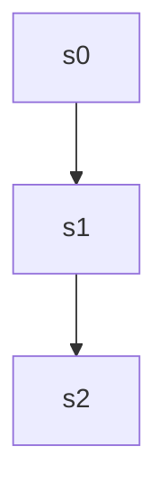

# gsm8k — `gsm8k-87` reasoning DAG

| model | steps | continue | backtrack | merge | depth | leaves | super-nodes |
|---|---|---|---|---|---|---|---|
| 32B | 8 | 7 | 0 | 0 | 7 | 1 | 1 |
| 1.5B | 3 | 2 | 0 | 0 | 2 | 1 | 1 |

## 32B — seed 1005, correct=True

`-->` continue &nbsp;&nbsp; `-.->` backtrack &nbsp;&nbsp; `==>` merge

### Steps and attachments

| step | action | parents | judge rationale | text |
|---|---|---|---|---|
| s0 | root | [] | root | First, I need to determine Sylvie's initial monthly salary, which is $600. |
| s1 | continue | [0] | The step s1 logically follows s0 by using the initial salary to calculate the annual increase, indicating a co | Since the company increases salaries by 10% of the initial salary every year for employees who have been with  |
| s2 | continue | [1] | s2 calculates the 10% increase of Sylvie's initial salary, which is a direct continuation of s1's reasoning ab | 10% of $600 is $60. |
| s3 | continue | [2] | s3 logically follows s2 by explaining the implication of the calculated 10% increase. It is a direct continuat | This means Sylvie receives an additional $60 each year. |
| s4 | continue | [3] | s4 logically follows from s3 by applying the annual increase over three years, continuing the main path withou | To find her salary after three more years, I will add the annual increase for each of the three years to her i |
| s5 | continue | [4] | s5 continues the calculation by multiplying the annual increase by three years, following directly from s4's i | So, $60 multiplied by 3 years equals $180. |
| s6 | continue | [5] | s6 logically follows s5 by adding the calculated increase to the initial salary, continuing the sequence witho | Adding this to her initial salary, $600 plus $180 gives a total of $780 per month. |
| s7 | continue | [6] | s7 is the next logical step after s6, calculating the annual salary based on the monthly salary determined in  | Finally, to find her annual salary, I multiply the monthly salary by 12 months, resulting in $9,360 per year. |

## 1.5B — seed 1002, correct=True

`-->` continue &nbsp;&nbsp; `-.->` backtrack &nbsp;&nbsp; `==>` merge

### Steps and attachments

| step | action | parents | judge rationale | text |
|---|---|---|---|---|
| s0 | root | [] | root | First, determine Sylvie's initial salary after five years of service. The company pays each employee $600 in a |
| s1 | continue | [0] | s1 logically follows s0 by calculating the salary increase based on the initial salary determined in s0. This  | Next, calculate the annual salary increase. The company increases salaries by 10% of the initial salary every  |
| s2 | continue | [1] | s2 logically follows s1 by applying the 10% increase over three years to compute Sylvie's new salary. | Finally, compute Sylvie's new annual salary after three more years of service. Adding the 10% increase to her  |
