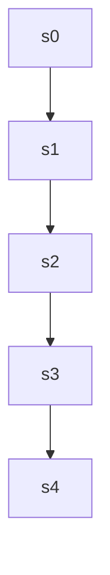
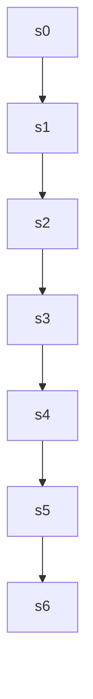

# webinstruct — `webinstruct-1589899` reasoning DAG

| model | steps | continue | backtrack | merge | depth | leaves | super-nodes |
|---|---|---|---|---|---|---|---|
| 32B | 5 | 4 | 0 | 0 | 4 | 1 | 1 |
| 1.5B | 7 | 6 | 0 | 0 | 6 | 1 | 1 |

## 32B — seed 1000, correct=True

`-->` continue &nbsp;&nbsp; `-.->` backtrack &nbsp;&nbsp; `==>` merge

### Steps and attachments

| step | action | parents | judge rationale | text |
|---|---|---|---|---|
| s0 | root | [] | root | First, I need to determine the incremental revenue that Bargain Electronics would receive from accepting the s |
| s1 | continue | [0] | The current step s1 logically follows s0 by calculating variable costs after determining revenue, continuing t | Next, I'll calculate the variable manufacturing costs. Each unit costs $20 to produce, and since Bargain Elect |
| s2 | continue | [1] | The step s2 introduces additional costs related to the special order, continuing the analysis from the previou | Additionally, there are special shipping costs of $4 per unit for this order. This means the total shipping co |
| s3 | continue | [2] | s3 logically follows s2 by using the calculated costs and revenue to determine the net income impact, continui | Now, I'll subtract the variable manufacturing costs and the shipping costs from the incremental revenue to det |
| s4 | continue | [3] | s4 logically follows s3 by using the net income calculation to make a decision, indicating a continuation. | Finally, based on the net income calculation, I'll decide whether Bargain Electronics should accept or reject  |

## 1.5B — seed 1001, correct=True

`-->` continue &nbsp;&nbsp; `-.->` backtrack &nbsp;&nbsp; `==>` merge

### Steps and attachments

| step | action | parents | judge rationale | text |
|---|---|---|---|---|
| s0 | root | [] | root | First, I need to calculate the total revenue generated by accepting the special order. The order consists of 4 |
| s1 | continue | [0] | s1 directly calculates the total revenue mentioned in s0, continuing the logical flow without backtracking or  | Total Revenue = 4,740 units × $26/unit = $123,240. |
| s2 | continue | [1] | s2 continues the analysis by moving from calculating revenue to determining costs, following the logical progr | Next, I'll determine the relevant costs associated with producing the special order. Since Bargain Electronics |
| s3 | continue | [2] | s3 calculates the total relevant costs based on the shipping cost mentioned in s2, continuing the analysis fro | Total Relevant Costs = 4,740 units × $4/unit = $18,960. |
| s4 | continue | [3] | s4 logically follows s3 by calculating net income after determining total revenue and costs. | Now, I'll find the net income by subtracting the total relevant costs from the total revenue. |
| s5 | continue | [4] | s5 calculates the net income by subtracting the total relevant costs from the total revenue, which is a direct | Net Income = $123,240 - $18,960 = $104,280. |
| s6 | continue | [5] | s6 concludes the calculation by summarizing the net income increase, logically following s5's computation. It  | Therefore, accepting the special order would result in a net income increase of $104,280. |
